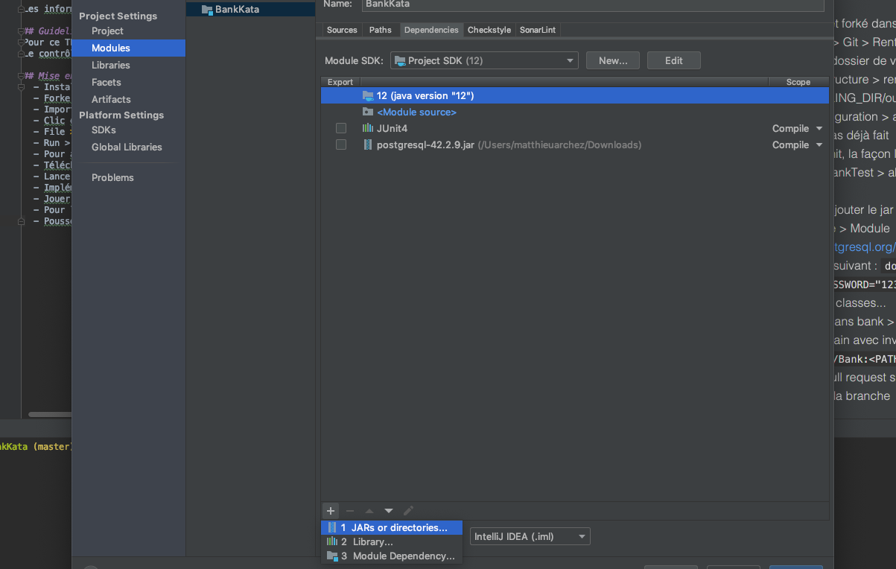

# Bank

## Description
En tant qu'utilisateur de mon application Bank, je dois pouvoir :
  - Créer un compte, contenant le nom du client, son solde actuel et son découvert autorisé (qui doit être négatif ou nul)
  - Pouvoir bloquer un compte
  - Pouvoir changer le solde du compte (retirer ou ajouter de l'argent) dans la limite du découvert autorisé et seulement si la personne n'est pas interdit banquaire
  - Pouvoir afficher la liste de tous les comptes
  - Gérer les entrées illégales dans la ligne de commande (pas de crash...)
  
Les informations enregistrées dans l'application doivent être persistantes et stockées dans une base de données PostGreSQL.

## Guidelines
Pour ce TP, il est plus efficace de s'occuper d'abord de la partie objet avant de d'occuper de la partie persistance des données.
Le contrôle des entrées n'est pas testé mais sera évalué, vous pouvez ajouter vos propres tests si vous le voulez.

## Mise en place
  - Installer Docker sur vos machines
  - Forker le projet
  - Importer le projet forké dans IntelliJ Idea : File > New > Project from Version Control > Git > Rentrer l'url du dépôt
  - Clic droit sur le dossier de votre projet > Mark Directory as Root Source
  - File > Project Structure > renseigner votre jdk et votre fichier de sortie <VOTRE_WORKING_DIR/out>
  - Run > Edit Configuration > ajouter une Application > Renseigner votre jdk si ce n'est pas déjà fait
  - Pour ajouter JUnit, la façon la plus simple est la suivante : allez dans le fichier bank > BankTest > alt-Enter sur un @Test rouge > add JUnit to classpath
  - Télécharger le driver ([PostGres](https://jdbc.postgresql.org/download/postgresql-42.2.9.jar) OU [MySql](https://dev.mysql.com/downloads/connector/j/)) et ajouter le jar aux modules dans File > Project Structure > Module
  - Pour lancer votre base, vous pouvez utiliser une application MySql (dans ce cas décommentez la partie MySql dans le fichier Bank) ou Postgres de votre choix, ou via Docker :
    - Lancer le script suivant pour postgres : ```docker run --rm -P -p 127.0.0.1:5439:5432 -e POSTGRES_PASSWORD="1234" --name pg postgres:10.8```
    - Si vous voulez utiliser mysql via docker : ```docker run -rm --name mysqldb -p 3306:3306 -e MYSQL_ROOT_PASSWORD=1234 -e MYSQL_USER=bank_user -e MYSQL_PASSWORD=1234 -e MYSQL_DATABASE=bank_db -d mysql/mysql-server:5.7```
  - Implémenter les classes...
  - Jouer les tests dans bank > BankTest
  - Pour lancer le Main avec invite de commande : ```java  -classpath out/production/BankKata:<PATH_DRIVER_POSTGRES_OU_MYSQL> Main.java```
  - Pousser votre pull request sur le dépôt, mettez votre nom et prénom dans le nom de la branche


